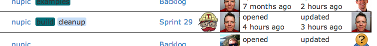

# Sprinter Dash

<table>
<tr>
  <td>
    
  </td>
  <td>
    
This is a web dashboard for <a href="https://github.com/rhyolight/sprinter.js">sprinter</a> with client-side filters.
  </td>
</tr>
</table>

Sprinter Dash is a web frontend for viewing issues from multiple GitHub issue trackers on one view. It provides views for:

- recent issues (past 2 days)
- current issues \[default\] (past 2 months, open and closed)
- old issues (created over 6 months ago)
- stale issues (updated over 2 months ago)

Once issues are loaded on the client, they can be filtered locally by:

- repository
- assignee
- type (PR or issue)
- state (closed / open)
- label
- milestone ("Sprints")

## Authentication with GitHub

You must provide GitHub credentials to run SprinterDash. They can be provided as environment variables: `GH_USERNAME`, `GH_PASSWORD`. In this case, they are picked up automatically and used. Or you can specify them in the `SprinterDash` constructor if attaching to an existing Express application (see [below](#incorporate-into-your-own-express-server)).

## Quick Start

For this example to work, simply clone this repo and set the following environment variables: `GH_USERNAME`, `GH_PASSWORD`. Then run:

    npm install .
    node index.js

This will start a server monitoring a couple of default repositories.

### Use your own repos

You can specify what repositories to gather issues from with a comma-delimited list of repository slugs. Specified repositories must have GitHub Issues enabled.

    node index.js org1/repo1,org1/repo2,org2/repo3

## Incorporate into your own Express server

You can create an instance of `SprinterDash` and attach it to an existing Express application. This is how it is used at <http://status.numenta.org/issues>.

    var SprinterDash = require('sprinter-dash');
    var dash = new SprinterDash({
        repos: ['org1/repo1', 'org1/repo2']
      , ghUsername: <GITHUB USERNAME>
      , ghPassword: <GITHUB PASSWORD OR AUTH TOKEN>
    });
    var app = express();
    dash.attach(app, 'dashboard');
    app.listen(8080);

SprinterDash will be running on `http://localhost:8080/dashboard`. The following views are available, where `<url-prefix>` is `dashboard` in the above example:

- `/<url-prefix>/issues` will display all issues within the past 2 months with a filter bar.
- `/<url-prefix>/issues/:login` will display issues assigned to the user specified by `:login`, as well as issues mentioning the same user.
- `/<url-prefix>/priority` will display issues in priority order if you have `P1`, `P2`, `P3`, & `P4` labels. 

### Available Data Routes

When using the `attach()` function, SprinterDash will set up the following data routes that you can call from your application's front-end:

- `/<url-prefix>/_issues`: returns all issues updated within 2 months
- `/<url-prefix>/_recentIssues`: returns all issues updated within 2 days
- `/<url-prefix>/_oldIssues`: returns all issues over 6 months old
- `/<url-prefix>/_staleIssues`: returns all issues updated over 2 months ago

These URLs will return JSON issue data.

### Available Template Routes

`/<url-prefix>/client/templates/issues.html` is the location of the Handlebars template used to render issues client-side. You can re-use this to provide the SprinterDash view in any page of your website (as shown in <http://status.numenta.org/>). 

The `<url-prefix>` defaults to `dash`, but can be specified by passing a the `urlPrefix` parameter to `attach()` as shown in the example above.

## Show Travis-CI build status

If you pass a `travisOrg` into SprinterDash, Travis-CI builds will be shown when running in the issue table. 

    var dash = new SprinterDash({
        repos: ['org1/repo1', 'org1/repo2']
      , travisOrg: 'rhyolight' // GitHub org or username
      , ghUsername: <GITHUB USERNAME>
      , ghPassword: <GITHUB PASSWORD OR AUTH TOKEN>
    });

