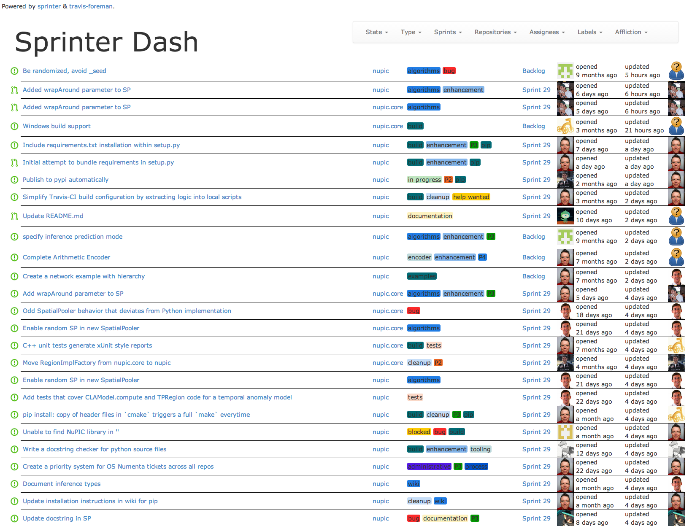

# Sprinter Dash

> Powered by [sprinter](https://github.com/rhyolight/sprinter.js)

<table>
<tr>
  <td>
    
  </td>
  <td>
    
This is a web UI for <a href="https://github.com/rhyolight/sprinter.js">sprinter</a>. It is under construction.
  </td>
</tr>
</table>

## Authentication with GitHub

You must provide GitHub credentials to run SprinterDash. They can be provided as environment variables: `GH_USERNAME`, `GH_PASSWORD`. In this case, they are picked up automatically and used. Or you can specify them in the `SprinterDash` constructor.

## Start the sample server

For this example to work, set the following environment variables: `GH_USERNAME`, `GH_PASSWORD`.

    node index.js

This will start a server monitoring a couple of default repositories.

### Use your own repos

You can specify what repositories to gather issues from with a comma-delimited list of repository slugs.

    node index.js org1/repo1,org1/repo2,org2/repo3

## Incorporate into your own Express server

You can create an instance of `SprinterDash` and attach it to an existing Express application.

    var SprinterDash = require('sprinter-dash');
    var dash = new SprinterDash({
        repos: ['org1/repo1', 'org1/repo2']
      , ghUsername: <GITHUB USERNAME>
      , ghPassword: <GITHUB PASSWORD OR AUTH TOKEN>
    });
    var app = express();
    dash.attach(app, 'dashboard');
    app.listen(8080);

SprinterDash will be running on `http://localhost:8080/dashboard`.

When using the `attach()` function, SprinterDash will set up the following data routes that you can call from your application's front-end:

- `/<url-prefix>/_issues`: returns all issues updated within 2 months
- `/<url-prefix>/_recentIssues`: returns all issues updated within 2 days
- `/<url-prefix>/_oldIssues`: returns all issues over 6 months old
- `/<url-prefix>/_staleIssues`: returns all issues updated over 2 months ago

The `<url-prefix>` defaults to `dash`, but can be specified by passing a the `urlPrefix` parameter to `attach()` as shown in the example above.

## Show Travis-CI build status

If you pass a `travisOrg` into SprinterDash, Travis-CI builds will be shown when running in the issue table. 

    var dash = new SprinterDash({
        repos: ['org1/repo1', 'org1/repo2']
      , travisOrg: 'rhyolight' // GitHub org or username
      , ghUsername: <GITHUB USERNAME>
      , ghPassword: <GITHUB PASSWORD OR AUTH TOKEN>
    });
